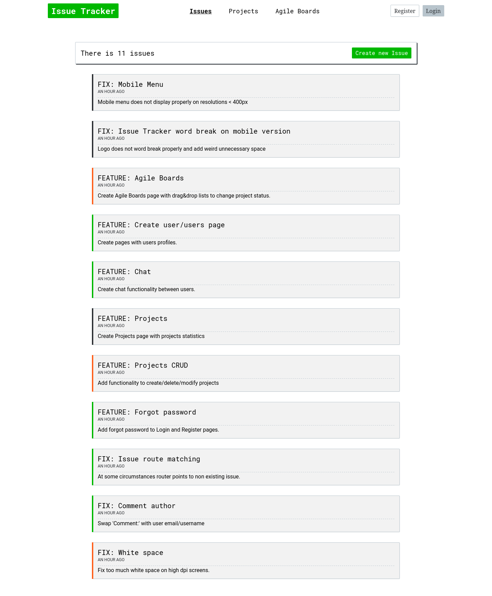

# Issue Tracker

Issue Tracker is a tool used internally to track bugs and feature requests during product development.
It has authentication & authorization system that govern which users can find, view, create and modify issues
Use the Agile Boards to support you with your Scrum, Kanban, and mixed processes. 
## Table of contents

- [Overview](#overview)
  - [Preview](#preview)  
  - [Features](#features)
  - [Links](#links)
  - [Built with](#built-with)
  - [Installation](#setup)


## Overview

### Preview



### Features

- React responsive frontend
- CRUD operations
- Authentication & Authorization
- Drag&Drop Agile Boards
- Flask REST Api backend
- Redis database as cache for tasks
- Sending emails through Gmail SMTP  
- PostgreSQL database
- Swagger documentation for api

### Links

- Live Site URL: [https://issue-tracking-frontend.vercel.app/](https://issue-tracking-frontend.vercel.app/)

### Built with
- 
- Semantic HTML5 markup
- Mobile-first workflow
- CSS Flexbox & Grid
- Sass preprocessor
- React.js
- Typescript
- Flask, SqlAlchemy, Marshamllow
- PostgreSQL, Redis
- Docker, Docker-Compose

### Setup
```
$ cd cd issue-tracking-frontend
$ npm install
$ npm start
```
